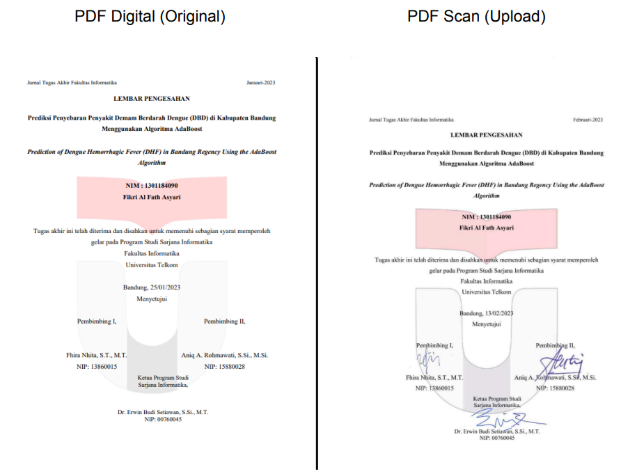
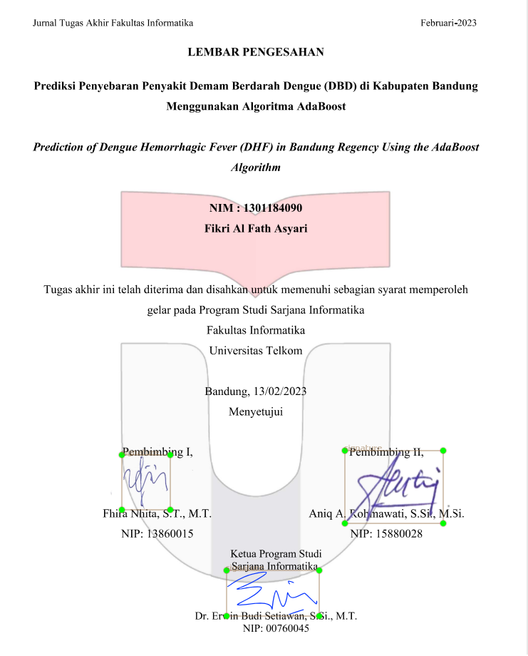

## An OCR-based document verification system developed from a real-world internship case.

This project simulates a document verification system that compares scanned documents with digital versions using OCR and signature detection.

### Important Note
This project is based on a real-world internship case.

Due to data confidentiality, the original dataset (government financial documents) cannot be shared.  
This repository uses simulated/sample data to demonstrate the workflow.

The trained YOLO model file is not included due to size and training constraints.

### Features
- Document text comparison using OCR  
- Signature detection using YOLOv8  
- Signature similarity checking (ORB)  
- Rule-based validation system  

### Tech Stack
- Python  
- YOLOv8 (Ultralytics)  
- OpenCV  
- Tesseract OCR  
- RapidFuzz  

### How It Works
1. Convert PDF to image  
2. Detect signature regions using YOLO  
3. Extract text using OCR  
4. Compare text similarity  
5. Validate signatures  

### System Demonstration
Document Comparison:


What happens in the system:


### Output
```json
{
  "Similarity Text (%)":96.7,
  "Jumlah TTD A": 0,
  "Jumlah TTD B": 3,
  "Hasil": "DITOLAK: TTD TIDAK LENGKAP"
}
```

### Why is it rejected?
This example uses a document that contains only **3 signatures**.

However, the current system is configured to **require exactly 4 signatures** for validation.  
As a result, the document is marked as **incomplete**.

At this stage, the system does not dynamically determine how many signatures should be present.  
The validation rule is still manually defined.

### Insight

This project highlights how rule-based validation can be effective but also limited.  
Future improvements could include dynamic detection of required signatures based on document type.
